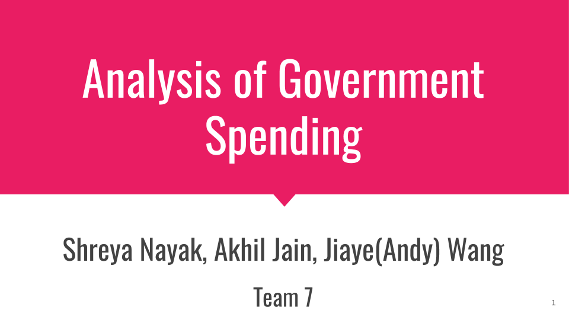

# README

## Members of Team 7

Akhil Jain (@ECEAkhil)

Shreya Nayak (@ShreyaNayak7)

Jiaye Wang (@AndyWang121)

## Topic: Analysis of Government Expenditure

We wanted to learn about the following:
* general trends of government expenditure
* correlation between life expectancy and health expenditure
* correlation between literacy rate and education expenditure
* correlation between poverty rate and social expenditure
* correlation between standard of living and happiness rank

## File Structure

Root
```
|
+----Code
|       | class_gather_data.py
|       | class_plot_functions.py
|       | class utilities.py
|       | ed_exp_vs_lit_rate_script.py
|       | folium_cloropleth_govt_exp_script.py
|       | gdp_pcapita_vs_hap_rank_script.py
|       | gov_exp_vs_year_script.py
|       | hl_exp_vs_life_exp_script.py
|       | Last Notebook.ipynb
|       | priority_bar_script.py
|       | social_exp_versus_pov_script.py
+----Files_Related_to_the_Presentation
|       | Analysis of Government Spending.pdf
|       | Analysis of Government Spending.pptx
|       | govt_exp_pcap.html
|       | line.html
+----Images
|       | Image_1.png
|       | Image_for_Methodology.png
README.md
Analysis of Government Spending.pdf
```
## Methodology


## Version of Python to Use
Python 3.7.3

## Descriptions of The Python Code in this Repository:

1. [**class_gather_data.py**](./Code/class_gather_data.py)

[**class_gather_data.py**](./Code/class_gather_data.py) should be made to have functions that can be used to store data in accessible formats for plotting purposes.

2. [**class_plot_functions.py**](./Code/class_plot_functions.py)

For the final presentation, a file called "**plot_functions.py**" was used to plot all of the scatter plots. [**class_plot_functions.py**](./plot_functions.py) is an object-oriented version of that **plot_functions.py** file.

3. [**class_utilities.py**](./Code/class_utilities.py)

[**utilities.py**](./utilities.py) is used for processing data so that a desired Pandas DataFrame can be obtained.

To see which scripts should be run for certain plots, please see the Jupyter Notebook.

*Please note that the following section may not be complete yet.*

## Citations for the Data that We Either Have Used or Would Use:


UNESCO Institute for Statistics. *Government expenditure on education, total (% of GDP)*. Retreived from http://api.worldbank.org/v2/en/indicator/SE.XPD.TOTL.GD.ZS?downloadformat=excel.

UNESCO Institute of Statistics. *Education [Filters: Youth literacy rate, population 15-24 years, both sexes (%); all countries; all years]*. Retreived from http://data.uis.unesco.org/Index.aspx?DataSetCode=EDULIT_DS&popupcustomise=true&lang=en#.


UNESCO Institute of Statistics. *Education [Filters: Adult literacy rate, population 15+ years, both sexes (%); all countries; all years]*. Retreived from http://data.uis.unesco.org/Index.aspx?DataSetCode=EDULIT_DS&popupcustomise=true&lang=en#.

* Downloaded CSV files

Organization for Economic Co-operation and Development. *Health expenditure and financing* and *Life expectancy*. Retreived from https://stats.oecd.org/Index.aspx?DataSetCode=SHA.

* Downloaded CSV files


Organization for Economic Co-operation and Development. *Social Expenditure - Aggregated Data*. Retreived from https://stats.oecd.org/Index.aspx?datasetcode=SOCX_AGG.
* Downloaded CSV file

OECD (2019), Poverty rate (indicator). doi: 10.1787/0fe1315d-en (Accessed on 04 June 2019)
* Retrieved from https://data.oecd.org/inequality/poverty-rate.htm

JohnSnowLabs. *Country and Continent Codes List*. Retreived from a link on https://datahub.io/JohnSnowLabs/country-and-continent-codes-list#data. Link for the actual data: https://pkgstore.datahub.io/JohnSnowLabs/country-and-continent-codes-list/country-and-continent-codes-list-csv_csv/data/b7876b7f496677669644f3d1069d3121/country-and-continent-codes-list-csv_csv.csv.

World Happiness Reports. https://www.kaggle.com/unsdsn/world-happiness or https://www.kaggle.com/unsdsn/world-happiness#2017.csv.

The World Bank. *GDP per capita (current US$)*. https://data.worldbank.org/indicator/ny.gdp.pcap.cd.

## Some of the Third-Party Modules Used

1. Pandas
1. Matplotlib
1. Bokeh
1. Folium
1. NumPy

## A Clarification

A commit that says the following:

    I inserted "@staticmethod".

was not intended to have a link to the GitHub user who has a username of "staticmethod".